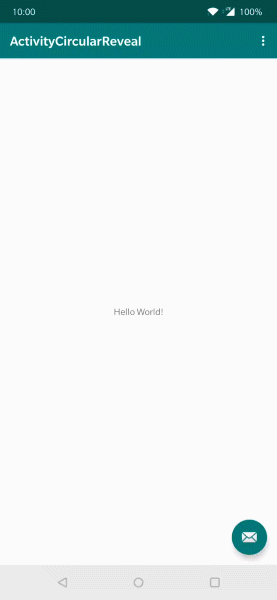

# ActivityCircularReveal

[](https://jitpack.io/#tombayley/ActivityCircularReveal)
[](https://android-arsenal.com/api?level=22)


A library for starting & finishing Android activities with a circular animation.

Code based on & modified from this article:
https://android.jlelse.eu/a-little-thing-that-matter-how-to-reveal-an-activity-with-circular-revelation-d94f9bfcae28

Usable in Lollipop 5.0+ projects. Circular reveal only working in Lollipop 5.1+.

## Demo

| Example |
| --- |
| []() |

To try the example, either build the project yourself, or install the `example.apk`


## How to include
Add the repository to your project build.gradle:
```
allprojects {
    repositories {
        ...
        maven { url 'https://jitpack.io' }
    }
}
```

And add the library to your module build.gradle:
```
dependencies {
    implementation 'com.github.tombayley:ActivityCircularReveal:1.0.1'
}
```


## Usage
In the activity you are starting another one from:

##### Kotlin
```kotlin
CircularReveal.presentActivity(CircularReveal.Builder(
    this,
    viewClicked,
    Intent(this, OtherActivity::class.java),
    1000
))
```
<details>
<summary>Java</summary>

```java
CircularReveal.presentActivity(new CircularReveal.Builder(
    this,
    viewClicked,
    new Intent(this, OtherActivity.class),
    1000
));
```
</details>


In the activity that you want to start:

##### Kotlin
```kotlin
private lateinit var mActivityCircularReveal: CircularReveal

override fun onCreate(savedInstanceState: Bundle?) {
    super.onCreate(savedInstanceState)
    setContentView(R.layout.activity_other)

    val rootView: View = // ...
    mActivityCircularReveal = CircularReveal(rootView)
    mActivityCircularReveal.onActivityCreate(intent)
}

override fun onBackPressed() {
    mActivityCircularReveal.unRevealActivity(this)
}
```

<details>
<summary>Java</summary>

```java
private CircularReveal mActivityCircularReveal;

override fun onCreate(savedInstanceState: Bundle?) {
    super.onCreate(savedInstanceState)
    setContentView(R.layout.activity_other)

    View rootView = // ...
    mActivityCircularReveal = new CircularReveal(rootView);
    mActivityCircularReveal.onActivityCreate(getIntent());
}

override fun onBackPressed() {
    mActivityCircularReveal.unRevealActivity(this)
}
```
</details>


The following must be called when you want to finish the activity.
```
mActivityCircularReveal.unRevealActivity(this)
```


Add this to the activity you want to circular reveal in the manifest:
```
android:theme="@style/CircularReveal"
```


And then add the style to your styles.xml:
```
<style name="CircularReveal" parent="AppTheme">
    <item name="android:windowIsTranslucent">true</item>
</style>
```


And finally add the following to your root view in each activity you are revealing or starting a reveal from:
```
android:background="MY_ACTIVITY_BACKGROUND_COLOR"
android:fitsSystemWindows="true"
```


## Customising

##### Duration
Change the 4th parameter in the CircularReveal.Builder (in milliseconds)

##### Reveal color
Default uses no color.
Useful if your two activities have the same background color, so the activity change is more noticeable.
```kotlin
builder.revealColor = ContextCompat.getColor(this, R.color.colorPrimary)
```

##### Starting an activity for a result
You can then use `onActivityResult()` as normal
```kotlin
builder.requestCode = MY_REQUEST_CODE
```


## TODO
- Work with Lollipop 5.0
